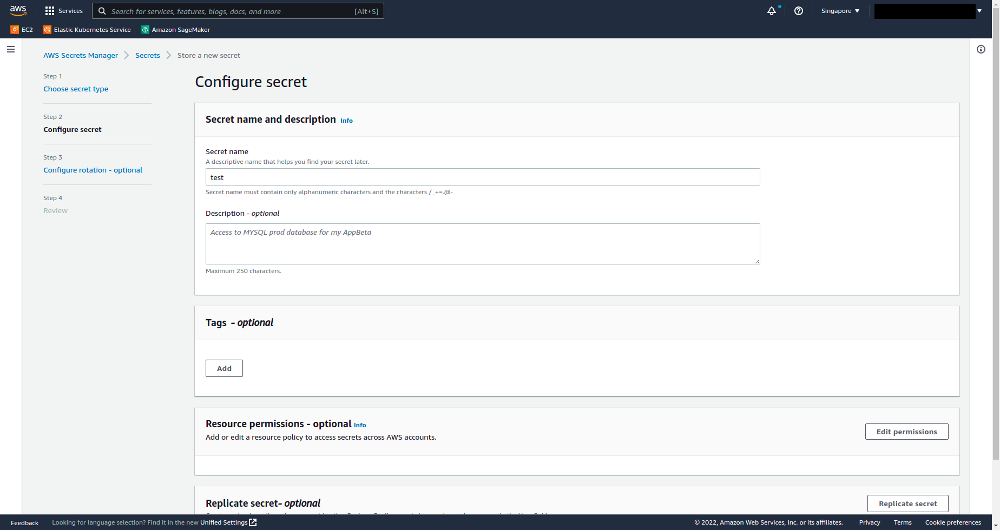
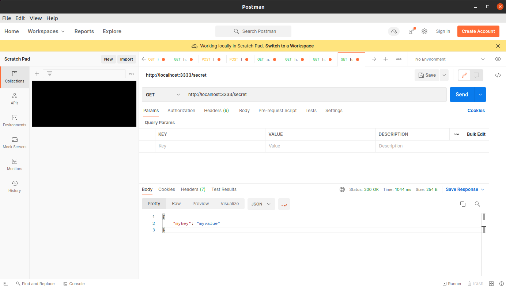
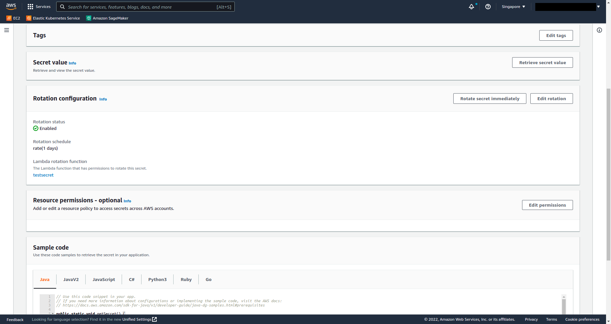
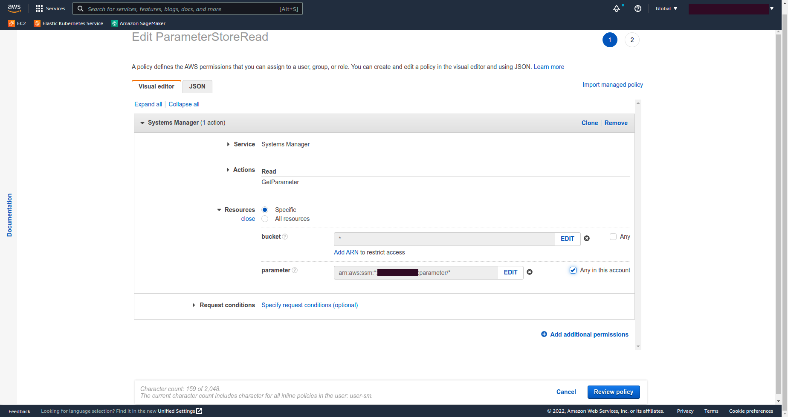
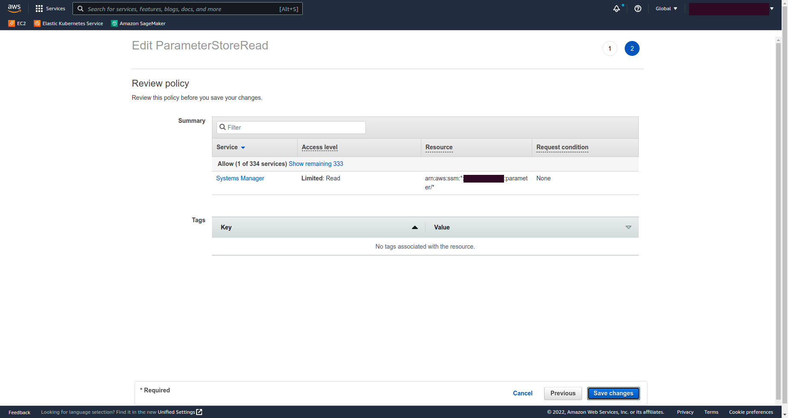
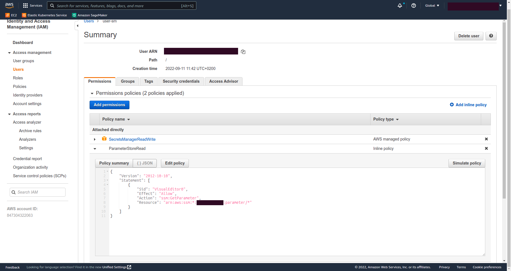
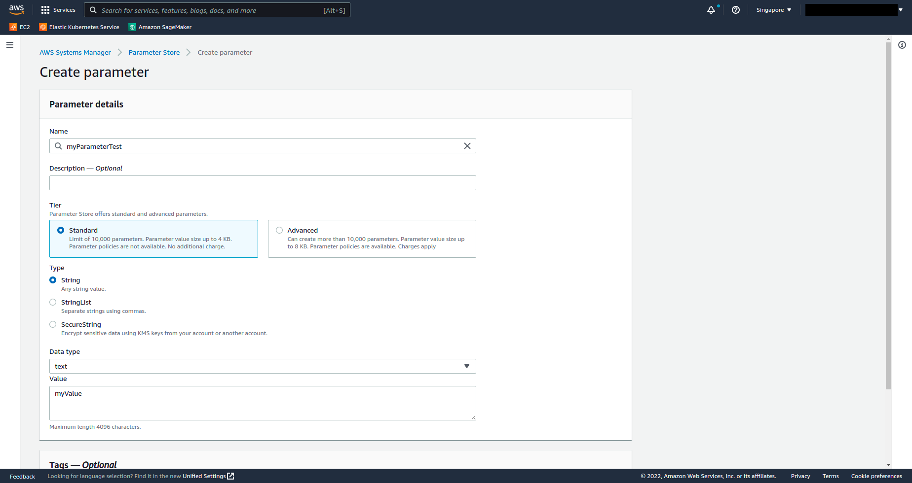
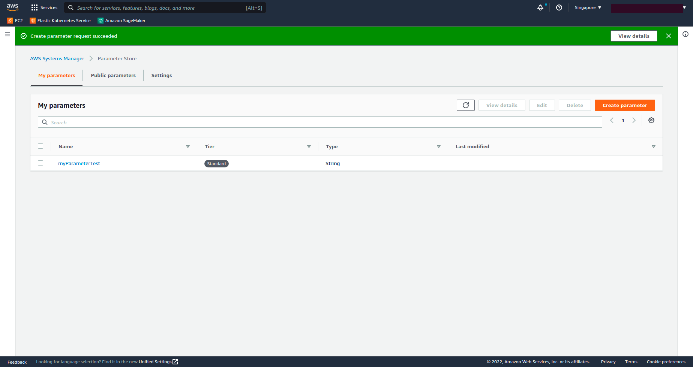
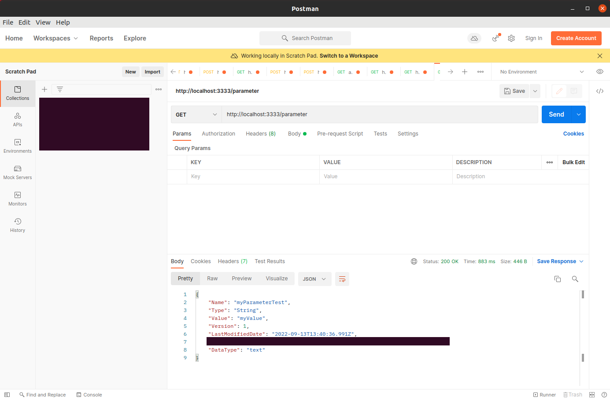

# LABORATORY-AWS-SECRET

Secret Manager and Parameter store available in the System Manager of AWS are both tool for creating and managing the secret of our application. As I am learning everything about AWS, I wanted to test it how it work for each api.

Even if those two tools are similar, they have two big difference that should drive you to choose one over the other:

- **Rotation**: Secret Manager has a feature allowing us to rotate the secret, providing a higher level of security.
- **Price**: Parameter Store is free up to 10k secrets while Secret Manager is not at all. Every secret will be included in your bill.

## Plan of the presentation

I explain with all the details how I build the project and my way of working.

- [Secret Manager](#secret-manager)
- [Parameter Store](#parameter-store)
- [Running](#running)
- [System](#system)

## Secret Manager

#### Create a IAM user with the right policies

Before even starting, we need to create a role with a custom trust policies with the following:

```json
{
  "Statement": [
    {
      "Action": ["secretsmanager:GetSecretValue"],
      "Effect": "Allow",
      "Resource": "*"
    }
  ]
}
```

#### Create secrets

Search for the `Secret Manager` in the AWS console and click on the button on the right `Store a new secret`.
Since I want to keep a key/value pair, I choose the `other type of secret`.


I enter a name for my secret and put if I want to a tag.



And that's all!

#### Code

The code for getting our secret from Secret Manager is in the `experience.ts` file located in the `api/src/app` folder.

```js
const AWS = require("aws-sdk");

const access = {
  accessKeyId: process.env.ACCESS_KEY,
  secretAccessKey: process.env.SECRET_ACCESS_KEY,
  region: process.env.REGION,
};

const client = new AWS.SecretsManager(access);
```

This first part create the connection to the SM with the credential that we can find in the environment file.

```js
let secret;
try {
  const data = await client
    .getSecretValue({ SecretId: process.env.SECRET_ID })
    .promise();
  if (data.SecretString) secret = data.SecretString;
  res.send(secret ? JSON.parse(secret) : secret);
} catch (error) {
  throw error;
}
```

This part is responsible to get the secret value using the id of the secret.

#### Test

I can now see on my Postman the result of my call:



## Secret Rotation



## Parameter Store

#### Create a IAM user with the right policies

Same as for Secret Manager, we need to create a custom role with the right policies for using the GetParameter function.
Pay attention to the Ressource or else it wont work.

```json
{
  "Statement": [
    {
      "Effect": "Allow",
      "Action": ["ssm:GetParameter"],
      "Resource": "arn:aws:ssm:*:xxxxxxxxxx:parameter/*"
    }
  ]
}
```





#### Create secrets

For creating a secret, it's quite simple. Search for `System Manager` and in the right menu, click on the `Parameter Store` submenu.
Once there, click on the `Create parameter` button in order to create a new secret.



It's a one window step, click on save and you should arrive at the same as this screenshot.



#### Code

It work the same way as with `Secret Manager`, we first need to use our credential to access the api.

```js
const AWS = require("aws-sdk");
const router = express.Router();

const access = {
  accessKeyId: process.env.ACCESS_KEY,
  secretAccessKey: process.env.SECRET_ACCESS_KEY,
  region: process.env.REGION,
};

const ssmClient = new AWS.SSM(access);
```

Once done, we can get the parameter using the name that has been filled up in the AWS Console.

```js
try {
  const data = await ssmClient
    .getParameter({ Name: "myParameterTest" })
    .promise();
  res.send(data.Parameter);
} catch (error) {
  throw error;
}
```

#### Test

I can now see on my Postman the result of my call:



## Running

I am using NX, so for starting the project use the following command:

```bash
$ nx serve api
```

For testing the app, use Postman.


## System

Ubuntu Version: Ubuntu 20.04.1 LTS
Node Version: v16.15.1

```bash
# Get the version of node
$ node -v

# Get the latest version of ubuntu
$ lsb_release -a
```
