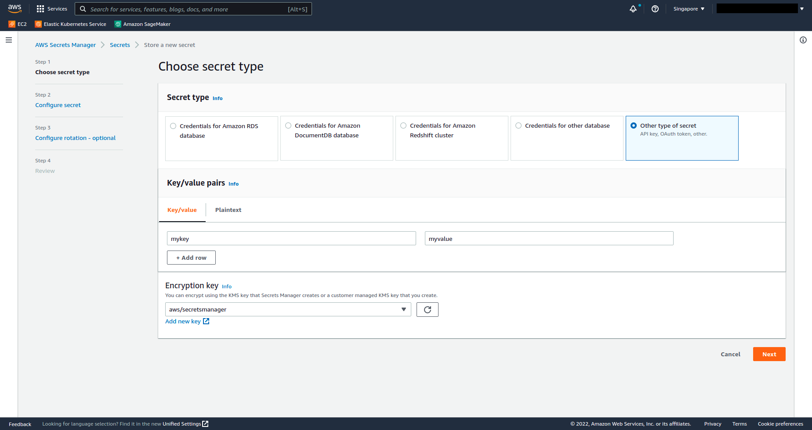

# LABORATORY-AWS-SECRET-MANAGER

For reading the secret or either give "SecretsManagerReadWrite" policy




```
{
    "Version": "2012-10-17",
    "Statement": [
        {
            "Effect": "Allow",
            "Action": [
                "ssm:GetParameter"
            ],
            "Resource": "arn:aws:ssm:*:xxxxxxxxxx:parameter/*"
        }
    ]
}
```

```policy
secretsmanager:GetSecretValue
{
    "Statement": [
        {
            "Action": [
                "secretsmanager:GetSecretValue"
            ],
            "Effect": "Allow",
            "Resource": "*"
        }
    ]
}
```
